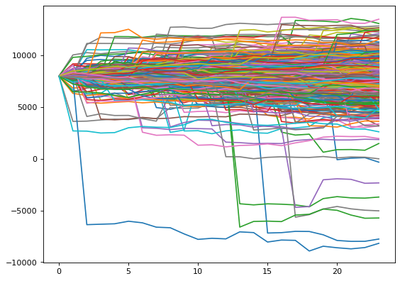
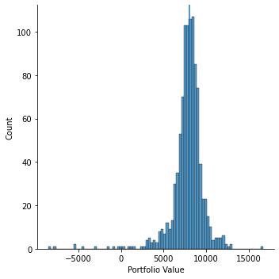
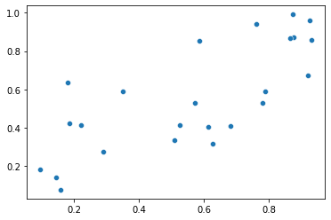
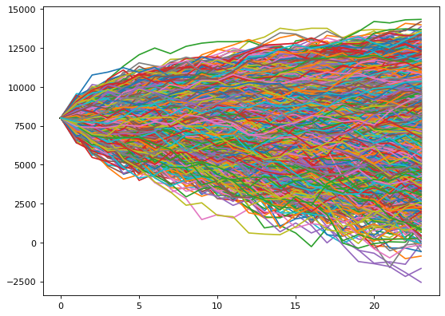

```python
import numpy as np
import pandas as pd
import matplotlib.pyplot as plt
import seaborn as sns
from datetime import datetime
from datetime import timedelta
from random import randrange

#Import Price Data from picke files
avax = pd.read_pickle("./Price_Data/1HOUR/AVAX-USD.pkl")
eth = pd.read_pickle("./Price_Data/1HOUR/ETH-USD.pkl")
btc = pd.read_pickle("./Price_Data/1HOUR/BTC-USD.pkl")

btc.head()
```


<div>
<style scoped>
    .dataframe tbody tr th:only-of-type {
        vertical-align: middle;
    }

    .dataframe tbody tr th {
        vertical-align: top;
    }

    .dataframe thead th {
        text-align: right;
    }
</style>
<table border="1" class="dataframe">
  <thead>
    <tr style="text-align: right;">
      <th></th>
      <th>startedAt</th>
      <th>updatedAt</th>
      <th>market</th>
      <th>resolution</th>
      <th>low</th>
      <th>high</th>
      <th>open</th>
      <th>close</th>
      <th>baseTokenVolume</th>
      <th>trades</th>
      <th>usdVolume</th>
      <th>startingOpenInterest</th>
    </tr>
  </thead>
  <tbody>
    <tr>
      <th>0</th>
      <td>2021-03-01T17:00:00.000Z</td>
      <td>2021-03-01T17:00:04.762Z</td>
      <td>BTC-USD</td>
      <td>1HOUR</td>
      <td>48887</td>
      <td>48887</td>
      <td>48887</td>
      <td>48887</td>
      <td>0.02</td>
      <td>1</td>
      <td>977.74</td>
      <td>0.2645</td>
    </tr>
    <tr>
      <th>1</th>
      <td>2021-03-01T16:00:00.000Z</td>
      <td>2021-03-01T16:00:09.102Z</td>
      <td>BTC-USD</td>
      <td>1HOUR</td>
      <td>50438.9253</td>
      <td>50438.9253</td>
      <td>50438.9253</td>
      <td>50438.9253</td>
      <td>0</td>
      <td>0</td>
      <td>0</td>
      <td>0.2645</td>
    </tr>
    <tr>
      <th>2</th>
      <td>2021-03-01T15:00:00.000Z</td>
      <td>2021-03-01T15:00:05.733Z</td>
      <td>BTC-USD</td>
      <td>1HOUR</td>
      <td>49166</td>
      <td>50438.9253</td>
      <td>49166</td>
      <td>50438.9253</td>
      <td>0.04</td>
      <td>2</td>
      <td>1992.098506</td>
      <td>0.2645</td>
    </tr>
    <tr>
      <th>3</th>
      <td>2021-03-01T14:00:00.000Z</td>
      <td>2021-03-01T14:00:02.456Z</td>
      <td>BTC-USD</td>
      <td>1HOUR</td>
      <td>48287</td>
      <td>48287</td>
      <td>48287</td>
      <td>48287</td>
      <td>0</td>
      <td>0</td>
      <td>0</td>
      <td>0.2645</td>
    </tr>
    <tr>
      <th>4</th>
      <td>2021-03-01T13:00:00.000Z</td>
      <td>2021-03-01T13:00:07.861Z</td>
      <td>BTC-USD</td>
      <td>1HOUR</td>
      <td>48250</td>
      <td>48287</td>
      <td>48250</td>
      <td>48287</td>
      <td>0.03</td>
      <td>2</td>
      <td>1448.24</td>
      <td>0.2645</td>
    </tr>
  </tbody>
</table>
</div>


```python
#Reduce DataFrame to close Prices
btc_closes = btc[['startedAt', 'close']]
eth_closes = eth[['startedAt', 'close']]
avax_closes = avax[['startedAt', 'close']]

#Change 
btc_closes.loc[:, 'close'] = btc_closes['close'].astype(float)
eth_closes.loc[:, 'close'] = eth_closes['close'].astype(float)
avax_closes.loc[:, 'close'] = avax_closes['close'].astype(float)

btc_closes.loc[:, 'returns'] = btc_closes["close"].pct_change()
eth_closes.loc[:, 'returns'] = eth_closes["close"].pct_change()
avax_closes.loc[:, 'returns_avax'] = avax_closes["close"].pct_change()
```


```python
result = pd.merge(btc_closes[['startedAt','returns']], eth_closes[['startedAt','returns']], on=["startedAt"], 
                  how='inner', suffixes=('_btc', '_eth'))
result = pd.merge(result, avax_closes[['startedAt','returns_avax']], on=["startedAt"], 
                  how='inner', suffixes=(tuple('_avax')))

result = result.iloc[1: , :]
result.index = result['startedAt']
result = result.drop(['startedAt'], axis=1)
result.head()
```


<div>
<style scoped>
    .dataframe tbody tr th:only-of-type {
        vertical-align: middle;
    }

    .dataframe tbody tr th {
        vertical-align: top;
    }

    .dataframe thead th {
        text-align: right;
    }
</style>
<table border="1" class="dataframe">
  <thead>
    <tr style="text-align: right;">
      <th></th>
      <th>returns_btc</th>
      <th>returns_eth</th>
      <th>returns_avax</th>
    </tr>
    <tr>
      <th>startedAt</th>
      <th></th>
      <th></th>
      <th></th>
    </tr>
  </thead>
  <tbody>
    <tr>
      <th>2021-05-08T04:00:00.000Z</th>
      <td>0.001292</td>
      <td>0.006944</td>
      <td>0.000000</td>
    </tr>
    <tr>
      <th>2021-05-08T03:00:00.000Z</th>
      <td>0.001995</td>
      <td>-0.007653</td>
      <td>0.016989</td>
    </tr>
    <tr>
      <th>2021-05-08T02:00:00.000Z</th>
      <td>0.002627</td>
      <td>-0.002175</td>
      <td>-0.010537</td>
    </tr>
    <tr>
      <th>2021-05-08T01:00:00.000Z</th>
      <td>-0.010838</td>
      <td>0.001614</td>
      <td>0.000000</td>
    </tr>
    <tr>
      <th>2021-05-08T00:00:00.000Z</th>
      <td>-0.002822</td>
      <td>-0.004466</td>
      <td>-0.004935</td>
    </tr>
  </tbody>
</table>
</div>


```python
#Initial Variables
Initial_USDC = 8000
hours = 24
iterations = 1000

#Start prices
btc_start_price = btc_closes.iloc[-1]['close']
eth_start_price = eth_closes.iloc[-1]['close']
avax_start_price = avax_closes.iloc[-1]['close']

#Position Sizes
btc_position = 20000/btc_start_price
eth_position = -10000/eth_start_price
avax_position = -10000/avax_start_price

btc_maintenence_margin = 0.03
eth_maintenence_margin = 0.03
avax_maintenence_margin = 0.05

Total_Maintenance_Margin_Requirement = abs(btc_position * btc_start_price * btc_maintenence_margin) + \
                                          abs(eth_position * eth_start_price * eth_maintenence_margin) +\
                                          abs(avax_position * avax_start_price * avax_maintenence_margin)

print("The total maintenace margin of this porfolio is: $", Total_Maintenance_Margin_Requirement)
```

    The total maintenace margin of this porfolio is: $ 1400.0
    


```python
%%time
portfolio_paths = pd.DataFrame()
liquidation_scenarios = pd.DataFrame()

for x in range(0,iterations):
    #Generate Price Paths
    price_paths = np.full((hours, 3), float(1))
    price_paths[0] = [btc_start_price, eth_start_price, avax_start_price]
    for t in range(1, hours):
        price_paths[t] = np.array(price_paths[t-1]*(1 + result.iloc[randrange(len(result))]), dtype=float)
    price_paths

    #Calculate Maintenance Margin
    maintenance_margin = price_paths * np.array([abs(btc_position), abs(eth_position), abs(avax_position)]) * np.array([
        btc_maintenence_margin, eth_maintenence_margin, avax_maintenence_margin])
    maintenance_margin = np.sum(maintenance_margin, axis=1)
    maintenance_margin

    #Calculate Total Account Value
    Total_Account_Value = Initial_USDC + np.sum((price_paths - price_paths[0]) * np.array([
        btc_position, eth_position, avax_position]), axis=1)
    Total_Account_Value
    
    portfolio_paths = pd.concat([portfolio_paths, pd.DataFrame(Total_Account_Value)], axis=1)
    liquidation_scenarios = pd.concat([liquidation_scenarios, pd.DataFrame(Total_Account_Value > maintenance_margin)], axis=1)
```

    Wall time: 22.5 s
    


```python
from matplotlib.pyplot import figure
figure(figsize=(8, 6), dpi=80)

plt.plot(portfolio_paths)
plt.show()
df = liquidation_scenarios.apply(pd.Series.value_counts).T
print("The portfolio would have been liquidated ", df[False].count(), " times out of 1000")
```


    

    


    The portfolio would have been liquidated  11  times out of 1000
    


```python
print("The average portfolio value is: ", portfolio_paths.iloc[23].mean())
print("The median portfolio value is: ", portfolio_paths.iloc[23].median())
print("The maximum portfolio value is: ", portfolio_paths.iloc[23].max())
print("The minimum portfolio value is: ", portfolio_paths.iloc[23].min())

VaR = np.percentile(portfolio_paths.iloc[23], 5, axis=0)
ES = portfolio_paths.iloc[23][portfolio_paths.iloc[23] <= np.percentile(portfolio_paths.iloc[23], 5, axis=0)].mean()

print("\nPortfolio VaR: ", VaR, "\nA VaR of ", VaR, "  suggests that we are \
95% certain that our portfolio will be greater than ", VaR, 
     "\n in the next 24 hours")

print("\nExpected Shortfall: ", ES, "\nOn the condition that the 24h loss is greater than the 5th percentile" 
      " of the loss distribution, it is expected that \n the portfolio will be ", ES)
```

    The average portfolio value is:  7779.475661232638
    The median portfolio value is:  7998.923635638381
    The maximum portfolio value is:  17040.978325986034
    The minimum portfolio value is:  -15697.269919021826
    
    Portfolio VaR:  4927.791820568504 
    A VaR of  4927.791820568504   suggests that we are 95% certain that our portfolio will be greater than  4927.791820568504 
     in the next 24 hours
    
    Expected Shortfall:  1639.520069091123 
    On the condition that the 24h loss is greater than the 5th percentile of the loss distribution, it is expected that 
     the portfolio will be  1639.520069091123
    


```python
np.percentile(portfolio_paths.iloc[23], 5, axis=0)
```


    4927.791820568504


```python
sns.displot(portfolio_paths.iloc[23])
plt.axvline(x=portfolio_paths.iloc[23].median())
plt.xlabel('Portfolio Value')
```


    Text(0.5, 6.79999999999999, 'Portfolio Value')


    

    


# Monte Carlo Simulation


```python
from scipy.stats import multivariate_normal
from scipy.stats import norm
```


```python
correlations = result.corr(method='kendall') 
correlations
```


<div>
<style scoped>
    .dataframe tbody tr th:only-of-type {
        vertical-align: middle;
    }

    .dataframe tbody tr th {
        vertical-align: top;
    }

    .dataframe thead th {
        text-align: right;
    }
</style>
<table border="1" class="dataframe">
  <thead>
    <tr style="text-align: right;">
      <th></th>
      <th>returns_btc</th>
      <th>returns_eth</th>
      <th>returns_avax</th>
    </tr>
  </thead>
  <tbody>
    <tr>
      <th>returns_btc</th>
      <td>1.000000</td>
      <td>0.628845</td>
      <td>0.296755</td>
    </tr>
    <tr>
      <th>returns_eth</th>
      <td>0.628845</td>
      <td>1.000000</td>
      <td>0.325476</td>
    </tr>
    <tr>
      <th>returns_avax</th>
      <td>0.296755</td>
      <td>0.325476</td>
      <td>1.000000</td>
    </tr>
  </tbody>
</table>
</div>


```python
random_vals = multivariate_normal(cov=correlations).rvs(24)
copula = norm.cdf(random_vals)
print(copula.shape)
copula
```

    (24, 3)
    


    array([[0.8745467 , 0.8718216 , 0.29463386],
           [0.1431082 , 0.14204129, 0.33795999],
           [0.68200781, 0.41019104, 0.47529229],
           [0.18559957, 0.42202397, 0.05683012],
           [0.61252215, 0.4031239 , 0.28097567],
           [0.77939808, 0.52813868, 0.80083246],
           [0.9244255 , 0.9580551 , 0.5348669 ],
           [0.62749337, 0.31880557, 0.48113645],
           [0.92060841, 0.67431207, 0.87266754],
           [0.78818562, 0.59106414, 0.78674002],
           [0.18010436, 0.63436037, 0.32331315],
           [0.28867648, 0.27579783, 0.79184878],
           [0.58434561, 0.85336977, 0.0456162 ],
           [0.76183994, 0.93982814, 0.45646697],
           [0.52413178, 0.41561073, 0.42881328],
           [0.57261862, 0.53025049, 0.85089378],
           [0.92979615, 0.85688307, 0.83691351],
           [0.50778144, 0.33428234, 0.82240324],
           [0.87310307, 0.99150189, 0.73184063],
           [0.22068527, 0.41440229, 0.36388417],
           [0.86490814, 0.86552825, 0.79629915],
           [0.09565658, 0.18141841, 0.50113278],
           [0.34947901, 0.58893824, 0.96755319],
           [0.15833934, 0.07708653, 0.23613448]])


```python
sns.scatterplot(x=copula[:, 0], y=copula[:, 1])
```


    <AxesSubplot:>


    

    


```python
distribution_btc = norm(result['returns_btc'].mean(), result['returns_btc'].std())
distribution_eth = norm(result['returns_eth'].mean(), result['returns_eth'].std())
distribution_avax = norm(result['returns_avax'].mean(), result['returns_avax'].std())

btc_distribution = distribution_btc.ppf(copula[:, 0])
eth_distribution = distribution_eth.ppf(copula[:, 1])
avax_distribution = distribution_avax.ppf(copula[:, 2])
```


```python
portfolio_paths = pd.DataFrame()
liquidation_scenarios = pd.DataFrame()

for x in range(0,10000):
    
    random_vals = multivariate_normal(cov=correlations).rvs(24)
    copula = norm.cdf(random_vals)
    
    btc_distribution = distribution_btc.ppf(copula[:, 0])
    eth_distribution = distribution_eth.ppf(copula[:, 1])
    avax_distribution = distribution_avax.ppf(copula[:, 2])
    pct_paths = np.stack((btc_distribution, eth_distribution, avax_distribution), axis=1)
    
    price_paths = np.full((hours, 3), float(1))
    price_paths[0] = [btc_start_price, eth_start_price, avax_start_price]

    
    for t in range(1, hours):
        price_paths[t] = np.array(price_paths[t-1]*(1 + pct_paths[t-1]), dtype=float)
        price_paths

    #Calculate Maintenance Margin
    maintenance_margin = price_paths * np.array([
        abs(btc_position), abs(eth_position), abs(avax_position)]) * np.array([btc_maintenence_margin, 
                                                                               eth_maintenence_margin, avax_maintenence_margin])
    maintenance_margin = np.sum(maintenance_margin, axis=1)
    maintenance_margin

    #Calculate Total Account Value
    Total_Account_Value = Initial_USDC + np.sum((price_paths - price_paths[0]) * np.array([btc_position, eth_position, 
                                                                                           avax_position]), axis=1)
    Total_Account_Value

    portfolio_paths = pd.concat([portfolio_paths, pd.DataFrame(Total_Account_Value)], axis=1)
    liquidation_scenarios = pd.concat([liquidation_scenarios, pd.DataFrame(Total_Account_Value > maintenance_margin)], axis=1)
```


```python
from matplotlib.pyplot import figure
figure(figsize=(8, 6), dpi=80)

plt.plot(portfolio_paths)
plt.show()
df = liquidation_scenarios.apply(pd.Series.value_counts).T
print("The portfolio would have been liquidated ", df[False].count(), " times out of 10000")
```


    

    


    The portfolio would have been liquidated  111  times out of 10000
    
