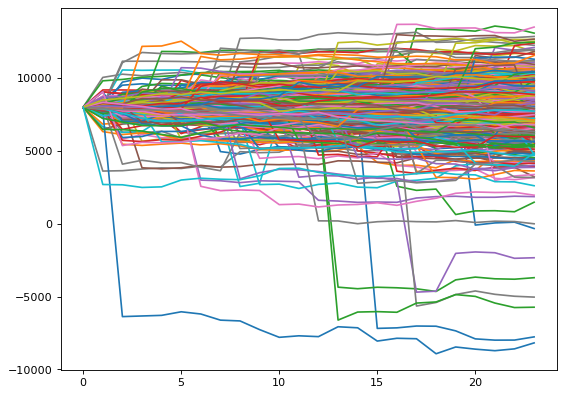
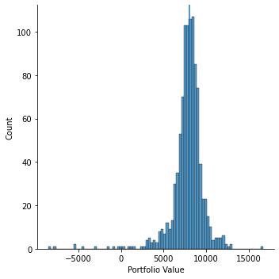
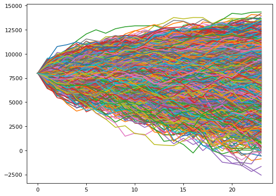

# Using simulations to predict the chance of liquidations on dYdX

In this article I will show you how to use Historical Simulation and Monte Carlo Simulation in Python to model your liquidation risk on dYdX. The dYdX Perpetual allows traders to leverage up to 10x long or short on cryptocurrencies given there is sufficient margin in the trading account. While this leverage allows traders to earn greater rewards, it also comes with its own set of risks. A Monte Carlo simulation runs an enormous number of statistical experiments with random numbers generated from a statistical distribution. A historical simulation also runs several statistical experiments but utilises randomised historical data instead. Together, these simulations can give us a better idea of liquidation risk on dYdX.  

## When will liquidations occur on dYdX?

A full description of how liquidations work can be found in the API docs. Accounts whose total value falls below the maintenance margin requirement may have their positions automatically closed by the liquidation engine. The total value of any account is the sum of any USDC in your account plus/minus the mark-to-market of your open perpetual positions. The maintenance margin is calculated below:

Total Maintenance Margin Requirement = Σ abs(Si × Pi × Mi)
Where:
•	S is the size of the position (positive if long, negative if short)
•	P is the oracle price for the market
•	I is the initial margin fraction for the market
•	M is the maintenance margin fraction for the market
 
The maintenance margin fraction for each cryptocurrency can be found in the details tab of each contract. All contracts on dYdX have a maintenance margin of 5% except for BTC-USD and ETH-USD which have 3% maintenance margin. This means an account with $100 could hold a position worth $2,000 before liquidation (although initial margin requirements are different to maintenance margin; you can only open positions 10x your equity).  

## What is a Monte Carlo and Historical Simulation?

It is a technique used to understand the impact of risk and uncertainty in prediction and forecasting models. The model is very useful when assessing risk associated with the asset, because it produces extreme outcomes and possibilities, and it can give you a sense of where the asset’s price is potentially heading in the future.
In this example I will create a simulation of 10,000 potential future outcomes for the price development of a portfolio of dYdX positions. We will then calculate the chance of these positions being liquidated in the next 24 hours.

## Step 1: Getting Data

First, we will need to get some historical price data from dYdX. You will need to install dydx-v3-python to interact with the dYdX API. Then run the below script to scrape hourly price data from dYdX. We only need the currencies in your portfolio, however the below script scrapes for all available futures on dYdX and stores it in a local ‘pickle’ file.


```python
from dydx3 import Client
from web3 import Web3
import pandas as pd
import datetime as datetime

client = Client(
    host='https://api.dydx.exchange'
)

markets = client.public.get_markets()
markets = pd.DataFrame(markets.data['markets'])

for futures_local_name in markets.columns:
    print(futures_local_name)
    time_increment = '1HOUR'
    
    if time_increment == '1HOUR':
        time_delta = datetime.timedelta(hours=90)
    elif time_increment == '4HOURS':
        time_delta = datetime.timedelta(hours=360)
    elif time_increment == '1DAY':
        time_delta = datetime.timedelta(days=90)
        
    timeseries = pd.DataFrame()
    new_results = True
    today = datetime.datetime.now()
    
    try: #if existing file
        timeseries = pd.read_pickle("./Price_Data/" + str(time_increment) + "/" + str(futures_local_name) + ".pkl")
        max_time = timeseries['startedAt'].max()
        start_time = datetime.datetime.strptime(max_time, "%Y-%m-%dT%H:%M:%S.%fZ")
        print(start_time)
    
    except FileNotFoundError: #if no existing file
        initial = '2021-02-26T00:00:00.000Z'
        start_time = datetime.datetime.strptime(initial, "%Y-%m-%dT%H:%M:%S.%fZ")
        print(start_time)
        
    while new_results == True:
        
        end_time = start_time + time_delta
        api_result = client.public.get_candles(
            market=futures_local_name,
            resolution=str(time_increment),
            from_iso=start_time,
            to_iso=end_time,
            limit=90
        )

        api_result = pd.DataFrame(api_result.data['candles'])
        timeseries = pd.concat([timeseries, api_result])
        timeseries = timeseries.drop_duplicates(subset=['startedAt'])    
        start_time = end_time
        
        timeseries.to_pickle("./Price_Data/" + str(time_increment) + "/" + str(futures_local_name) + ".pkl")
        timeseries = pd.read_pickle("./Price_Data/" + str(time_increment) + "/" + str(futures_local_name) + ".pkl")
        
        if start_time > today:
            new_results = False
```

## Step 2: Data Processing

On a new notebook, we import some relevant python libraries and the price data we downloaded before. dYdX provides several data fields but all we need is close price history. The API gives out data as string, so we need to change our data type to ‘float’ to calculate the percentage change on the day. We then combine our datasets into one for ease of use. 


```python
import numpy as np
import pandas as pd
import matplotlib.pyplot as plt
import seaborn as sns
from datetime import datetime
from datetime import timedelta
from random import randrange

#Import Price Data from picke files
avax = pd.read_pickle("./Price_Data/1HOUR/AVAX-USD.pkl")
eth = pd.read_pickle("./Price_Data/1HOUR/ETH-USD.pkl")
btc = pd.read_pickle("./Price_Data/1HOUR/BTC-USD.pkl")

btc.head()
```


<div>
<style scoped>
    .dataframe tbody tr th:only-of-type {
        vertical-align: middle;
    }

    .dataframe tbody tr th {
        vertical-align: top;
    }

    .dataframe thead th {
        text-align: right;
    }
</style>
<table border="1" class="dataframe">
  <thead>
    <tr style="text-align: right;">
      <th></th>
      <th>startedAt</th>
      <th>updatedAt</th>
      <th>market</th>
      <th>resolution</th>
      <th>low</th>
      <th>high</th>
      <th>open</th>
      <th>close</th>
      <th>baseTokenVolume</th>
      <th>trades</th>
      <th>usdVolume</th>
      <th>startingOpenInterest</th>
    </tr>
  </thead>
  <tbody>
    <tr>
      <th>0</th>
      <td>2021-03-01T17:00:00.000Z</td>
      <td>2021-03-01T17:00:04.762Z</td>
      <td>BTC-USD</td>
      <td>1HOUR</td>
      <td>48887</td>
      <td>48887</td>
      <td>48887</td>
      <td>48887</td>
      <td>0.02</td>
      <td>1</td>
      <td>977.74</td>
      <td>0.2645</td>
    </tr>
    <tr>
      <th>1</th>
      <td>2021-03-01T16:00:00.000Z</td>
      <td>2021-03-01T16:00:09.102Z</td>
      <td>BTC-USD</td>
      <td>1HOUR</td>
      <td>50438.9253</td>
      <td>50438.9253</td>
      <td>50438.9253</td>
      <td>50438.9253</td>
      <td>0</td>
      <td>0</td>
      <td>0</td>
      <td>0.2645</td>
    </tr>
    <tr>
      <th>2</th>
      <td>2021-03-01T15:00:00.000Z</td>
      <td>2021-03-01T15:00:05.733Z</td>
      <td>BTC-USD</td>
      <td>1HOUR</td>
      <td>49166</td>
      <td>50438.9253</td>
      <td>49166</td>
      <td>50438.9253</td>
      <td>0.04</td>
      <td>2</td>
      <td>1992.098506</td>
      <td>0.2645</td>
    </tr>
    <tr>
      <th>3</th>
      <td>2021-03-01T14:00:00.000Z</td>
      <td>2021-03-01T14:00:02.456Z</td>
      <td>BTC-USD</td>
      <td>1HOUR</td>
      <td>48287</td>
      <td>48287</td>
      <td>48287</td>
      <td>48287</td>
      <td>0</td>
      <td>0</td>
      <td>0</td>
      <td>0.2645</td>
    </tr>
    <tr>
      <th>4</th>
      <td>2021-03-01T13:00:00.000Z</td>
      <td>2021-03-01T13:00:07.861Z</td>
      <td>BTC-USD</td>
      <td>1HOUR</td>
      <td>48250</td>
      <td>48287</td>
      <td>48250</td>
      <td>48287</td>
      <td>0.03</td>
      <td>2</td>
      <td>1448.24</td>
      <td>0.2645</td>
    </tr>
  </tbody>
</table>
</div>


```python
#Reduce DataFrame to close Prices
btc_closes = btc[['startedAt', 'close']]
eth_closes = eth[['startedAt', 'close']]
avax_closes = avax[['startedAt', 'close']]

#Change 
btc_closes.loc[:, 'close'] = btc_closes['close'].astype(float)
eth_closes.loc[:, 'close'] = eth_closes['close'].astype(float)
avax_closes.loc[:, 'close'] = avax_closes['close'].astype(float)

btc_closes.loc[:, 'returns'] = btc_closes["close"].pct_change()
eth_closes.loc[:, 'returns'] = eth_closes["close"].pct_change()
avax_closes.loc[:, 'returns_avax'] = avax_closes["close"].pct_change()
```


```python
result = pd.merge(btc_closes[['startedAt','returns']], eth_closes[['startedAt','returns']], on=["startedAt"], 
                  how='inner', suffixes=('_btc', '_eth'))
result = pd.merge(result, avax_closes[['startedAt','returns_avax']], on=["startedAt"], 
                  how='inner', suffixes=(tuple('_avax')))

result = result.iloc[1: , :]
result.index = result['startedAt']
result = result.drop(['startedAt'], axis=1)
result.head()
```


<div>
<style scoped>
    .dataframe tbody tr th:only-of-type {
        vertical-align: middle;
    }

    .dataframe tbody tr th {
        vertical-align: top;
    }

    .dataframe thead th {
        text-align: right;
    }
</style>
<table border="1" class="dataframe">
  <thead>
    <tr style="text-align: right;">
      <th></th>
      <th>returns_btc</th>
      <th>returns_eth</th>
      <th>returns_avax</th>
    </tr>
    <tr>
      <th>startedAt</th>
      <th></th>
      <th></th>
      <th></th>
    </tr>
  </thead>
  <tbody>
    <tr>
      <th>2021-05-08T04:00:00.000Z</th>
      <td>0.001292</td>
      <td>0.006944</td>
      <td>0.000000</td>
    </tr>
    <tr>
      <th>2021-05-08T03:00:00.000Z</th>
      <td>0.001995</td>
      <td>-0.007653</td>
      <td>0.016989</td>
    </tr>
    <tr>
      <th>2021-05-08T02:00:00.000Z</th>
      <td>0.002627</td>
      <td>-0.002175</td>
      <td>-0.010537</td>
    </tr>
    <tr>
      <th>2021-05-08T01:00:00.000Z</th>
      <td>-0.010838</td>
      <td>0.001614</td>
      <td>0.000000</td>
    </tr>
    <tr>
      <th>2021-05-08T00:00:00.000Z</th>
      <td>-0.002822</td>
      <td>-0.004466</td>
      <td>-0.004935</td>
    </tr>
  </tbody>
</table>
</div>


## Step 3: Historical Simulation

As an example, we will model the chances of the following dYdX portfolio being liquidated in the next 24 hours over 10,000 simulations:

- Long $20,000 BTC-USD perp 

- Short $10,000 ETH-USD perp    

- Short $10,000 AVAX-USD perp  

- 8000 USDC <br>

An account whose total value falls below the maintenance margin requirement may have their positions automatically closed by the liquidation engine. We can calculate the maintenance margin by multiplying the size, price, and maintenance margins of our positions. The maintenance margin for our portfolio is $1,400.


```python
#Initial Variables
Initial_USDC = 8000
hours = 24
iterations = 1000

#Start prices
btc_start_price = btc_closes.iloc[-1]['close']
eth_start_price = eth_closes.iloc[-1]['close']
avax_start_price = avax_closes.iloc[-1]['close']

#Position Sizes
btc_position = 20000/btc_start_price
eth_position = -10000/eth_start_price
avax_position = -10000/avax_start_price

btc_maintenence_margin = 0.03
eth_maintenence_margin = 0.03
avax_maintenence_margin = 0.05

Total_Maintenance_Margin_Requirement = abs(btc_position * btc_start_price * btc_maintenence_margin) + \
                                          abs(eth_position * eth_start_price * eth_maintenence_margin) +\
                                          abs(avax_position * avax_start_price * avax_maintenence_margin)

print("The total maintenace margin of this porfolio is: $", Total_Maintenance_Margin_Requirement)
```

    The total maintenace margin of this porfolio is: $ 1400.0
    

Next we’ll start creating our randomised scenarios which we store in a pandas dataframe called ‘portfolio_paths’. We also create a dataframe called ‘liquidation_scenarios’ which will record the scenarios where our portfolio was liquidated. “price_paths” is an empty numpy array which we populate with the last available price of each future. We then use the randrange function to select a random hour of price action which we append to “price_paths”. We repeat this random selection until we get a 24-hour timeseries (‘hours’ variable). Once we have our time series, we can calculate our maintenance margin and portfolio value which both change with price. We then repeat this process until we get our 10,000 scenarios (‘iterations’ variable). More simulations create a more accurate picture of your portfolio risk distribution however larger simulation numbers can take longer to calculate.


```python
%%time
portfolio_paths = pd.DataFrame()
liquidation_scenarios = pd.DataFrame()

for x in range(0,iterations):
    #Generate Price Paths
    price_paths = np.full((hours, 3), float(1))
    price_paths[0] = [btc_start_price, eth_start_price, avax_start_price]
    for t in range(1, hours):
        price_paths[t] = np.array(price_paths[t-1]*(1 + result.iloc[randrange(len(result))]), dtype=float)
    price_paths

    #Calculate Maintenance Margin
    maintenance_margin = price_paths * np.array([abs(btc_position), abs(eth_position), abs(avax_position)]) * np.array([
        btc_maintenence_margin, eth_maintenence_margin, avax_maintenence_margin])
    maintenance_margin = np.sum(maintenance_margin, axis=1)
    maintenance_margin

    #Calculate Total Account Value
    Total_Account_Value = Initial_USDC + np.sum((price_paths - price_paths[0]) * np.array([
        btc_position, eth_position, avax_position]), axis=1)
    Total_Account_Value
    
    portfolio_paths = pd.concat([portfolio_paths, pd.DataFrame(Total_Account_Value)], axis=1)
    liquidation_scenarios = pd.concat([liquidation_scenarios, pd.DataFrame(Total_Account_Value > maintenance_margin)], axis=1)
```

    Wall time: 22.5 s
    

We visualise the 10,000 possibilities for our portfolio value in the next 24 hours. Our portfolio would have been liquidated 177 times out of 10,000 scenarios which implies a 1.77% chance of liquidation in the next 24 hours. 


```python
from matplotlib.pyplot import figure
figure(figsize=(8, 6), dpi=80)

plt.plot(portfolio_paths)
plt.show()
df = liquidation_scenarios.apply(pd.Series.value_counts).T
print("The portfolio would have been liquidated ", df[False].count(), " times out of 1000")
```


    

    


    The portfolio would have been liquidated  11  times out of 1000
    

There are a lot of extreme outcomes: some outcomes are predicting total portfolio loss and other for the portfolio to 3x in value. To make more sense of data, we can perform some basic statistical analysis:


```python
print("The average portfolio value is: ", portfolio_paths.iloc[23].mean())
print("The median portfolio value is: ", portfolio_paths.iloc[23].median())
print("The maximum portfolio value is: ", portfolio_paths.iloc[23].max())
print("The minimum portfolio value is: ", portfolio_paths.iloc[23].min())

VaR = np.percentile(portfolio_paths.iloc[23], 5, axis=0)
ES = portfolio_paths.iloc[23][portfolio_paths.iloc[23] <= np.percentile(portfolio_paths.iloc[23], 5, axis=0)].mean()

print("\nPortfolio VaR: ", VaR, "\nA VaR of ", VaR, "  suggests that we are \
95% certain that our portfolio will be greater than ", VaR, 
     "\n in the next 24 hours")

print("\nExpected Shortfall: ", ES, "\nOn the condition that the 24h loss is greater than the 5th percentile" 
      " of the loss distribution, it is expected that \n the portfolio will be ", ES)
```

    The average portfolio value is:  7779.475661232638
    The median portfolio value is:  7998.923635638381
    The maximum portfolio value is:  17040.978325986034
    The minimum portfolio value is:  -15697.269919021826
    
    Portfolio VaR:  4927.791820568504 
    A VaR of  4927.791820568504   suggests that we are 95% certain that our portfolio will be greater than  4927.791820568504 
     in the next 24 hours
    
    Expected Shortfall:  1639.520069091123 
    On the condition that the 24h loss is greater than the 5th percentile of the loss distribution, it is expected that 
     the portfolio will be  1639.520069091123
    


```python
np.percentile(portfolio_paths.iloc[23], 5, axis=0)
```


    4927.791820568504


```python
sns.displot(portfolio_paths.iloc[23])
plt.axvline(x=portfolio_paths.iloc[23].median())
plt.xlabel('Portfolio Value')
```


    Text(0.5, 6.79999999999999, 'Portfolio Value')


    

    


We can also calculate the Value-at-Risk and Expected Shortfall of our portfolio which are Tradfi metrics used to measure portfolio risk. VaR estimates how much our portfolio might lose with a given probability (95% in this case). Expected Shortfall is the expected portfolio value in the worst of cases.

## Step 4: Monte Carlo Simulation

Instead of using historical prices, a Monte Carlo simulation assumes some underlying distribution for our cryptocurrencies and samples form this distribution. To do this we assume that each cryptocurrency is normally distributed around its historical mean and standard deviation. We also assume that the historical correlations of BTC-ETH-AVAX continue. 
A detailed explanation of copulas is out of scope for this article. In short, copulas assume the lowest possible value a variable can have is 0 and the highest is 1. Copulas then generate a combination of values in this range such that the relationship implied by the correlation between the variables is maintained. We create such a copula with the BTC-ETH-AVAX correlation structure with the following code:


```python
from scipy.stats import multivariate_normal
from scipy.stats import norm
```


```python
correlations = result.corr(method='kendall') 
correlations
```


<div>
<style scoped>
    .dataframe tbody tr th:only-of-type {
        vertical-align: middle;
    }

    .dataframe tbody tr th {
        vertical-align: top;
    }

    .dataframe thead th {
        text-align: right;
    }
</style>
<table border="1" class="dataframe">
  <thead>
    <tr style="text-align: right;">
      <th></th>
      <th>returns_btc</th>
      <th>returns_eth</th>
      <th>returns_avax</th>
    </tr>
  </thead>
  <tbody>
    <tr>
      <th>returns_btc</th>
      <td>1.000000</td>
      <td>0.630356</td>
      <td>0.304424</td>
    </tr>
    <tr>
      <th>returns_eth</th>
      <td>0.630356</td>
      <td>1.000000</td>
      <td>0.332867</td>
    </tr>
    <tr>
      <th>returns_avax</th>
      <td>0.304424</td>
      <td>0.332867</td>
      <td>1.000000</td>
    </tr>
  </tbody>
</table>
</div>


```python
random_vals = multivariate_normal(cov=correlations).rvs(24)
copula = norm.cdf(random_vals)
print(copula.shape)
copula
```

    (24, 3)
    


    array([[0.96057986, 0.86336569, 0.70659341],
           [0.3500168 , 0.58962946, 0.44890944],
           [0.45301751, 0.3844835 , 0.68973267],
           [0.549984  , 0.51924149, 0.20274464],
           [0.59086783, 0.19015057, 0.53964085],
           [0.09270085, 0.73260886, 0.22045056],
           [0.74474335, 0.62286201, 0.93996074],
           [0.0981164 , 0.26608352, 0.13982726],
           [0.39493952, 0.36277463, 0.25706605],
           [0.18373152, 0.40039657, 0.86818045],
           [0.87110187, 0.88608667, 0.95987025],
           [0.90609558, 0.99121772, 0.83391469],
           [0.13152288, 0.14023155, 0.04825953],
           [0.91223335, 0.3120594 , 0.4892085 ],
           [0.93368687, 0.5813117 , 0.65038972],
           [0.48786977, 0.68896808, 0.27281812],
           [0.07289614, 0.39397808, 0.19728479],
           [0.03155325, 0.22982765, 0.44697371],
           [0.1779487 , 0.10913397, 0.72687806],
           [0.33220158, 0.66279067, 0.3259085 ],
           [0.88051439, 0.6743187 , 0.64963689],
           [0.81175623, 0.84638948, 0.92070851],
           [0.99688724, 0.91596755, 0.54748436],
           [0.71315065, 0.382691  , 0.74507275]])


We then convert the 0–1 values to the actual values we want to use for the returns of the cryptocurrencies in the portfolio. We use percent point functions for the distributions of each variable to the conversion.


```python
distribution_btc = norm(result['returns_btc'].mean(), result['returns_btc'].std())
distribution_eth = norm(result['returns_eth'].mean(), result['returns_eth'].std())
distribution_avax = norm(result['returns_avax'].mean(), result['returns_avax'].std())

btc_distribution = distribution_btc.ppf(copula[:, 0])
eth_distribution = distribution_eth.ppf(copula[:, 1])
avax_distribution = distribution_avax.ppf(copula[:, 2])
```

We then use this timeseries of percentages to calculate the simulated price of BTC-ETH-AVAX and calculate our portfolio metrics over 10,000 times.


```python
portfolio_paths = pd.DataFrame()
liquidation_scenarios = pd.DataFrame()

for x in range(0,10000):
    
    random_vals = multivariate_normal(cov=correlations).rvs(24)
    copula = norm.cdf(random_vals)
    
    btc_distribution = distribution_btc.ppf(copula[:, 0])
    eth_distribution = distribution_eth.ppf(copula[:, 1])
    avax_distribution = distribution_avax.ppf(copula[:, 2])
    pct_paths = np.stack((btc_distribution, eth_distribution, avax_distribution), axis=1)
    
    price_paths = np.full((hours, 3), float(1))
    price_paths[0] = [btc_start_price, eth_start_price, avax_start_price]

    
    for t in range(1, hours):
        price_paths[t] = np.array(price_paths[t-1]*(1 + pct_paths[t-1]), dtype=float)
        price_paths

    #Calculate Maintenance Margin
    maintenance_margin = price_paths * np.array([
        abs(btc_position), abs(eth_position), abs(avax_position)]) * np.array([btc_maintenence_margin, 
                                                                               eth_maintenence_margin, avax_maintenence_margin])
    maintenance_margin = np.sum(maintenance_margin, axis=1)
    maintenance_margin

    #Calculate Total Account Value
    Total_Account_Value = Initial_USDC + np.sum((price_paths - price_paths[0]) * np.array([btc_position, eth_position, 
                                                                                           avax_position]), axis=1)
    Total_Account_Value

    portfolio_paths = pd.concat([portfolio_paths, pd.DataFrame(Total_Account_Value)], axis=1)
    liquidation_scenarios = pd.concat([liquidation_scenarios, pd.DataFrame(Total_Account_Value > maintenance_margin)], axis=1)
```

Again, we can graph our results and see that our portfolio would have been liquidated 111 times out of 10,000. The Monte Carlo simulation suggests our portfolio has a 1.11% chance of being liquidated in the next 24 hours. 


```python
from matplotlib.pyplot import figure
figure(figsize=(8, 6), dpi=80)

plt.plot(portfolio_paths)
plt.show()
df = liquidation_scenarios.apply(pd.Series.value_counts).T
print("The portfolio would have been liquidated ", df[False].count(), " times out of 10000")
```


    

    


    The portfolio would have been liquidated  111  times out of 10000
    

## Further Considerations

Simulations give us a better idea of the probability of liquidations when running leverage on dYdX but we are ultimately making two assumptions about our simulation environment: (1) the past price action of our cryptos will continue into the future and (2) the past correlations between cryptos in our account will also continue. On (1), we are only using data from 2021 which may skew our results given how bullish crypto has been this year. One way to mitigate this would be to place greater weight on recent price data in our historical simulation or assume a different underlying distribution in our Monte Carlo simulation. On (2), relationships between cryptos can always change; in our dataset, AVAX had a massive run up that outperformed BTC and ETH. However, it may begin to correlate more with BTC/ETH as it becomes a more mature L1 solution. Ultimately, traders need to make an underlying judgement as to what distributions and correlations will persist into the future. 

## Steps Forward

I have distributed the above Jupyter Notebook as a Github repo: https://github.com/DannyArcherCrypto/dydx-simulations. To update your dYdX price history in the “Price_Data” folder, you will need to re-run the “dYdX Get History.ipynb” file.
On this Github repo you will also find the Risk_Calculator.py file which contains a generalised version of the above notebook. You will need to edit lines 13-17 to suit your own dYdX portfolio and then run the script to achieve all the output from the Jupyter Notebook in one simple step.

